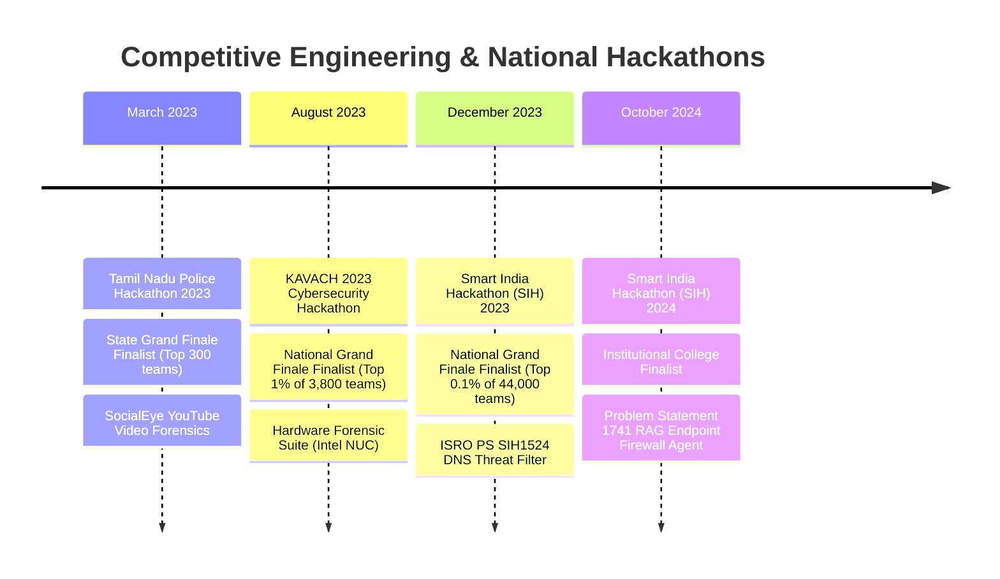

# Master Engineering Dossier & Career Knowledge Base (`Datas.md`)

> **Document Purpose:** Single comprehensive source of truth for Bewin Felix's verified engineering achievements, hackathons, production deployments, campus leadership roles, and architectural case studies. Designed to maintain an accurate historical record and serve as a modular foundation for tailoring resumes, technical portfolios, and interview discussions.  
> **Last Updated:** October 2026  
> **Current Role:** Specialist Programmer at Infosys (August 2025 – Present)  
> **Target Roles:** Full Stack Developer · Backend / Distributed Systems Engineer · GenAI / LLM Platform Engineer  

---

## 1. Executive Bio & Contact Information

* **Full Name:** Bewin Felix R A
* **Current Title:** Specialist Programmer, Infosys (August 2025 – Present)
* **Education:** B.Tech in Computer Science and Engineering (2021 – 2025), Karunya Institute of Technology and Sciences, Coimbatore
* **Location:** Coimbatore / Nagercoil, Tamil Nadu, India · Open to Relocate / Remote
* **Contact Information:**
  * **Email:** `biwinfelix@gmail.com`
  * **Phone:** `+91 7598393250`
  * **LinkedIn:** [linkedin.com/in/bewin-felix-4153a9232](https://linkedin.com/in/bewin-felix-4153a9232)
  * **GitHub:** [github.com/Bewin007](https://github.com/Bewin007)
* **Executive Summary:**
  > Systems-oriented Full-Stack and Generative AI Engineer with a proven track record of architecting high-concurrency web platforms, distributed backend microservices, and private LLM inference infrastructure. Experience spans building enterprise resource modules at Infosys within the TPD portal (FastAPI, React TSX, Recharts, PostgreSQL), serving campus-wide AI platforms for 8,000+ users on multi-GPU 4x L40S hardware (Triton Inference Server with `vllm_backend`, NeMo Guardrails), and reaching the Grand Finale of premier national competitions (Smart India Hackathon 2023 National Finalist, KAVACH 2023 Cybersecurity Finalist, Tamil Nadu Police Hackathon State Finalist).

---

## 2. Technical Stack Directory

### Languages
* **Primary:** Python (Advanced), TypeScript, JavaScript (ES6+), SQL
* *(Note: Java and C / C++ have been intentionally excluded from the primary technical stack to focus on core production specializations)*

### Frontend Engineering
* **Libraries & Frameworks:** React.js (TSX), Vite, Tailwind CSS, Recharts (Dynamic Enterprise Visualizations), Chakra UI, Material UI, HTML5, Modern CSS3
* *(Note: Next.js has been intentionally excluded from the primary technical stack)*

### Backend & Distributed Systems
* **Frameworks & Runtimes:** FastAPI (Async endpoints, Pydantic data schemas), Django, Django REST Framework (DRF), Node.js, Express.js
* **Architecture:** Asynchronous REST APIs, Microservices, Role-Based Access Control (RBAC), WebSocket Streaming, Background Worker Queues, Distributed Caching

### Databases, Storage & Vector Retrieval
* **Relational:** PostgreSQL (Complex Joins, Aggregation Pipelines, Index Optimization)
* **NoSQL / Document:** MongoDB
* **Time-Series:** InfluxDB
* **Vector Database:** **Milvus** (Dense vector embeddings for hybrid retrieval and RAG)
* **In-Memory Caching:** Redis

### Generative AI & Inference Systems
* **Inference Serving:** Triton Inference Server with `vllm_backend` (`https://github.com/triton-inference-server/vllm_backend`)
* **Hardware Deployment:** Multi-GPU `4x L40S` cluster
* **Speech-to-Text & Multi-Modal:** Whisper (Audio Transcription)
* **Safety & Guardrails:** **NeMo Guardrails** (NVIDIA), Pydantic deterministic schema validation
* **Retrieval & RAG:** Hybrid Semantic Retrieval (BM25 sparse search + Milvus dense vector embeddings), Cross-Encoder Re-rankers, Corrective RAG (CRAG), Agent State Machines
* **Interfaces & Observability:** Open WebUI, Graylog (Centralized telemetry, latency tracking, GPU thermals, safety tripwires)

### Systems, Networking & DevOps
* **Containers & Orchestration:** Docker, Docker Compose, Kubernetes, Nginx (Reverse Proxy & DNS Proxy)
* **Operating Systems & Scripting:** Linux (Ubuntu / Debian), Bash / Shell Scripting, Windows API
* **Network & Security Tooling:** Zeek (Bro) Network Security Monitor, Unbound DNS Resolver, Wireshark / TShark (Packet Inspection), Volatility (Memory Forensics), Sleuth Kit (Disk Forensics), Linux `iptables`
* *(Note: Traefik has been intentionally excluded)*

---

## 3. Verified Hackathons & Competitions Timeline

### 1. Tamil Nadu Police Hackathon 2023 (State Grand Finale Finalist)
* **Date:** March 28–29, 2023
* **Venue:** Chennai Finals · Organized by Tamil Nadu Police Department
* **Team:** **Team T3tra** (Varun - ML, Mukesh Kumar - Frontend/Network, Bewin Felix - Frontend & Backend, S Venkatesh - Server/Networking)
* **Problem Statement:** Social media video analysis — Classifying metadata in YouTube videos (Genre, Language, People, profanity, sensitive content).
* **Project Name:** **SocialEye**
* **Solution Architecture:**
  * Automated data collection via YouTube Data API and custom scraping tools.
  * Invariant data extraction: Uploader email, phone number, timezone, last login, subscriber count, dislike count (recovered via API), and linked social media accounts.
  * Dynamic media analysis: Audio extracted and converted to text via speech-to-text models; searched for profanity and hate speech. Video frames sampled and analyzed by computer vision for inappropriate or harmful visual artifacts. Sentiment analysis performed across comments and transcripts.
  * Frontend & Backend: Full-stack application developed by Bewin using React.js, Chakra UI, Recharts, Django REST Framework, and PostgreSQL/MongoDB to present an actionable forensic dossier to cybercrime investigators.
* **Result:** Selected as **State Grand Finale Finalist** out of 300 competing engineering teams across Tamil Nadu.

### 2. KAVACH 2023 Cybersecurity Hackathon (National Grand Finale Finalist)
* **Date:** August 2023
* **Venue:** Odisha Grand Finale · Organized by AICTE, Ministry of Education, and Bureau of Police Research & Development (BPR&D), Govt of India
* **Theme:** Digital Forensics & Cybercrime Investigation
* **Project Name:** **Hardware Forensic Suite**
* **Solution Architecture:**
  * Engineered a self-contained, portable forensic triage toolbox running on a virtualized Intel NUC hardware unit designed for law enforcement field investigations.
  * Integrated established command-line forensic utilities (`dd`, Volatility memory analysis, Sleuth Kit disk inspection, and TShark network packet analysis) into a unified graphical interface built with Electron.js, Python, and C/C++ (interfacing C binaries directly via Python).
  * Provided write-blocking evidence acquisition to capture volatile RAM states, active network sockets, and file system artifacts without corrupting media integrity.
  * Generated automated, court-admissible PDF forensic reports summarizing SHA-256 hashes, memory strings, and running process trees.
* **Result:** Selected as **National Grand Finale Finalist** from 3,800 national cybersecurity teams (Top 1% across India).

### 3. Smart India Hackathon (SIH) 2023 (National Grand Finale Finalist)
* **Date:** December 2023
* **Venue:** Gujarat Grand Finale · Organized by AICTE & Ministry of Education, Govt of India
* **Ministry / Partner:** Indian Space Research Organisation (ISRO)
* **Problem Statement Code:** **SIH1524** [Software] — "Domain Name Server (DNS) Filtering Service using Threat Intelligence feeds and AI/ML Techniques"
* **Team Name:** **NetOptiq / Team NetOptics** (Issac Gladin S - Lead, Gifton Paul Immanuel, Bewin Felix, Shirlyn Jenita J, Allen Matthew, Jerin Stalin; Mentor: Prof. S E Vinodh Ewards)
* **Project Name:** **SIH DNS Threat Filter**
* **Solution Architecture:**
  * High-performance cloud architecture running a Kubernetes cluster of load-balanced DNS servers (HAProxy, Nginx DNS Proxy, Unbound DNS caching server).
  * Real-time packet tap: DNS queries intercepted and analyzed by Zeek (Bro) network monitor to extract domain characteristics and payload entropy.
  * Threat intelligence integration: Continuously updated blacklist synchronized via STIX/TAXII, MISP, AbuseIPDB, and CIRCL OSINT feeds into CockroachDB and MongoDB.
  * AI Detection Engine: Ensemble ML models (SVM + XGBoost: 97.7% accuracy) for phishing/malicious classification; LSTM + DistilBERT Transformer (98.1% accuracy) for identifying Domain Generation Algorithms (DGA).
  * Management Dashboard: React.js frontend with Material UI and Django REST Framework backend; integrated Grafana and Prometheus for live telemetry and threat visualization.
* **The 2:00 PM Emergency Hackathon Sprint (5 Hours Before Jury):**
  * At 2:00 PM (with the final evaluation deadline set for 8:00 PM), the team discovered that certain legitimate high-traffic domains were being misclassified solely based on short lexical domain names (e.g., X.com was incorrectly categorized as adult content).
  * Rather than risking a complete multi-hour model retrain, Bewin engineered an asynchronous secondary web crawler in Python in under 5 hours.
  * The crawler ran in the background, fetched live page semantics and metadata without blocking the primary DNS resolution path, verified actual site functionality, and dynamically patched false-positive sinkholes. The system was shipped live and demonstrated successfully to ISRO and government evaluators.
* **Result:** Selected as **National Grand Finale Finalist** (Top 0.1% out of 44,000 national teams across India).

### 4. Smart India Hackathon (SIH) 2024 (Institutional College Finalist)
* **Date:** October 2024
* **Venue:** Karunya Institute of Technology and Sciences Institutional Selection
* **Problem Statement ID:** **1741** — "Centralized application-context aware firewall" (Theme: Blockchain & Cybersecurity)
* **Team:** **Team Night's Watch** (Team ID: K24030)
* **Project Name:** **RAG Endpoint Firewall Agent**
* **Solution Architecture:**
  * Lightweight client endpoint agent software running in Go utilizing the Windows API to monitor process-level network sockets, traffic composition, bandwidth consumption, and communicating IP/domain endpoints.
  * Centralized firewall server with a web dashboard built with React.js, Django REST Framework, InfluxDB (time-series network logs), PostgreSQL (firewall rules & policies), and Grafana/Prometheus monitoring.
  * **Hybrid RAG & Policy Synthesis:** Integrated **Milvus** vector database storing historical security advisories, CVE datasets, and MITRE ATT&CK mitigation playbooks. An LLM agent autonomously synthesizes verified, granular firewall policies (blocking offending ports, protocols, or malicious remote IPs) applied directly to host kernel tables (Linux `iptables` / Windows filtering).
  * Multi-Class Anomaly Detection: Evaluated on benchmark cybersecurity datasets including CSECIC-IDS2018 (80 features), ISCX-Botnet-2014, CIC-UNSW-NB15, and PerimeterX TestBed Dataset.
  * **Deterministic Guardrails:** Hardcoded whitelist protecting critical administrative ports (22, 53, 80, 443) to guarantee that AI-synthesized rules could never sever host management connectivity.
* **Result:** Selected as **Institutional College Finalist** for SIH 2024 (chose not to proceed to national stage due to institutional constraints).

---

## 4. Leadership, Community & Campus Career

### KHacks (Student-Run Technical Organization · Motto: "Learn, Build, Compete")
* **July 2022:** Joined KHacks as a contributing member.
* **December 2022:** Elevated to **Core Team Member**.
  * Over entire tenure, conducted **50+ technical workshops**, maintaining an active schedule of **2–4 workshops per month** with **50–300+ participants** per session depending on the venue. Topics included Docker containerization, modern backend architectures, Git workflows, and web development fundamentals for engineering students from internal and external colleges.
  * Contributed to an AI education outreach initiative delivering foundational AI literacy to **500+ government-school students** in a single day.
* **August – September 2023:** **Founder & Head of the Web & App Development Club**.
  * Formulated the club charter, curriculum, and operational roadmap from scratch.
  * Personally trained and mentored **200+ students** in modern web technologies (HTML/CSS, JavaScript, React, REST APIs).
  * Actively guided club members into participating in competitive hackathons and qualifying for paid internal university projects through the "Earn While You Learn" scheme.
* **December 2024:** Transitioned to **Mentor**.
  * Held full executive and decision-making authority, but voluntarily stepped down from the primary leadership role to establish clear succession, empower junior leadership, and remain as an ongoing advisor and technical backbone for the club.

### Mindkraft (Karunya's Annual National Technical Symposium)
* **Mindkraft 2023 — Stackmasters:** Organized and led the "Stackmasters" technical coding and web development competition, managing registrations and event execution for **2,000+ registered participants**.
* **Mindkraft 2024 Portal:** Served as lead developer and deployment manager for the official Mindkraft 2024 web portal. Built with React.js, Django REST Framework, and Python; implemented automated ticketing and dynamic QR code generation/distribution for hundreds of event attendees.

### Karunya "Earn While You Learn" Scheme (2023 – 2025)
* Selected for Karunya University's competitive paid engineering program during summer breaks (2023, 2024, and 2025).
* Led multi-student development teams architecting and delivering internal university software tools, enterprise portals, and academic management systems on institutional server infrastructure.

### Karunya Computer Technology Center (CTC) Summer Internships
* **Summer 2022–2023:**
  * Explored laboratory virtualization architectures, investigating hardware constraints and feasibility for reusing existing desktop machines as thin-client terminals.
  * Initiated the **Smart Karunya** project: designed a centralized campus digital twin to collect and visualize environmental and utility metrics (air quality, temperature, soil moisture, weather forecasting, power consumption). Spent 50 days conducting research, gathering documentation, and creating working proof-of-concept prototypes.
* **Summer 2024–2025:**
  * Investigated a comprehensive redesign of the official Karunya University website from scratch by customizing Drupal templates and restructuring content pipelines. (Project was later shelved due to institutional budget and resource allocation shifts).
  * Maintained and updated the official Karunya University Drupal portal and related WordPress departmental web properties.

---

## 5. Complete Project Compendium

### 1. `sofie(Chatbot)` (Campus-Wide Private Generative AI Platform)
* **Timeline:** 2024
* **Role:** Lead Architect & Systems Engineer
* **Scope:** Production campus-wide private LLM service for **8,000+ students, faculty, and research departments**.
* **Tech Stack:** Triton Inference Server with `vllm_backend` (`https://github.com/triton-inference-server/vllm_backend`), Multi-GPU `4x L40S` cluster, NeMo Guardrails, Open WebUI, FastAPI, Python, Graylog, Docker.
* **Origin Story & The "Ego Spark":**
  * Sparked by a technical debate with a friend over NVIDIA's proprietary NIM architecture. Bewin argued that equivalent high-throughput, enterprise-grade inference serving could be built entirely on open-source software. Driven to prove the point, he built the platform using Triton Inference Server with `vllm_backend`.
  * Catalyzed concurrently by campus lab restrictions: university computer labs had blocked public AI services (ChatGPT, Claude) due to uncritical copying of assignment code. The institution needed a private, curriculum-aware AI tutor that explained concepts step-by-step rather than outputting raw solutions.
* **Core Capabilities & Workloads:**
  * Assisting students in learning complex theoretical concepts and algorithms.
  * Summarizing lengthy research papers, journals, and documentation.
  * Drafting outlines for academic presentations, reports, and coursework.
  * Language translation, grammar review, and academic writing assistance.
  * Brainstorming project concepts and research hypotheses.
  * Explaining code bugs, logic errors, and algorithm time complexity.
  * **Automated SIH Hackathon Evaluation:** Served as the official automated evaluation engine for **500+ student teams** participating in internal college-level SIH hackathons, reviewing technical procedure manuals and verifying implementation completeness when experienced faculty reviewers were unavailable.
* **Architecture Highlights:**
  * Deployed open-source LLaMA models on a dedicated multi-GPU **4x L40S** cluster using continuous batching via Triton's `vllm_backend`.
  * Integrated **NeMo Guardrails** to enforce institutional safety policies, block prompt injection, and restrict raw solution dumping.
  * Centralized Graylog pipeline collecting token generation latency, GPU thermals, and guardrail tripwires.
* **Verified Outcomes:** 100% on-premise data privacy; zero recurring cloud API subscription costs; robust multi-tenant concurrency. *(Note: All previous "sub-80ms" claims have been removed).*

---

### 2. Demand Module — TPD Enterprise Portal (Infosys)
* **Timeline:** August 2025 – Present
* **Role:** Specialist Programmer
* **Scope:** Internal enterprise module developed for the TPD (Talent Planning & Deployment) portal at Infosys.
* **Tech Stack:** React (TSX), FastAPI, Recharts, PostgreSQL. *(Note: LangGraph and Node.js are excluded from this module).*
* **Confidentiality & Context:**
  * Developed strictly to internal business team specifications and operational requirements. In compliance with enterprise confidentiality policy, proprietary headcounts, client details, and internal numbers are not disclosed.
  * The feature concept and requirements were provided by the delivery and business teams. Bewin engineered the frontend user interfaces and backend REST endpoints; deployment was managed by the platform DevOps team.
* **What Bewin Built:**
  * **Demand Module Visualizations:** Built dynamic, interactive analytical visualization views in React (TSX) and Recharts tracking talent allocation states against open project demands.
  * **Automated Demand Fulfillment Reporting:** Built asynchronous aggregation endpoints in FastAPI backed by PostgreSQL to compile demand-vs-talent fulfillment reports, helping delivery and talent leads monitor allocation statuses.
* **Architecture:** React TSX frontend communicating with asynchronous FastAPI REST endpoints executing PostgreSQL queries, handed off to the enterprise DevOps team for CI/CD containerized deployment.

---

### 3. CodeTutor (DSA Preparation & Automated Lab Evaluator)
* **Timeline:** October 2025 – November 2025
* **Role:** Sole Developer
* **Scope:** Campus Placement Preparation Portal (DSA Module) & Academic Lab Evaluation.
* **Tech Stack:** React.js, Django REST Framework, PostgreSQL, Triton Inference Server with `vllm_backend`, LLaMA models, NeMo Guardrails, **Judge0 API**, Docker.
* **Architecture & Details:**
  * Designed to train students in Data Structures and Algorithms (DSA) ahead of technical interviews.
  * Students attempt coding problems directly within the web editor. If unable to solve a problem, an integrated AI tutor guides them conceptually—explaining algorithmic logic and step-by-step intuition without handing over raw code (at most providing minimal illustrative snippets).
  * **Compilation Engine:** Integrated **Judge0 API** for compiling and verifying test cases in **Python, C, C++, and Java**.
  * **Clarification on Sandboxing:** CodeTutor is **not sandboxed directly on the host**; compilation and evaluation are delegated to the Judge0 engine. A Docker running engine was prototyped for executing React and Node.js environments, but remained unreleased/untested in production due to complexities in programmatically verifying dynamic browser DOM rendering.

---

### 4. LabTutor (Automated Lab Management & Examination Portal)
* **Timeline:** October 2025 – November 2025
* **Role:** Sole Developer
* **Scope:** University Computer Science Department Laboratory Evaluation Platform.
* **Tech Stack:** React.js, Django REST Framework, PostgreSQL, Docker, Judge0, `pdflatex`, code-server.
* **Architecture & Details:**
  * Reused core evaluation components from CodeTutor to create a dedicated university laboratory examination portal.
  * Faculty portal allows instructors to configure experiments, input input/output test cases, and specify edge conditions.
  * Standard programming submissions (Python, C, C++, Java) are automatically evaluated via Judge0 and auto-graded.
  * For graphical and web development frameworks (Tkinter, React), the system spins up an in-browser `code-server` environment where students write and run code; faculty review running instances with a single click and assign manual scores.
  * **Automated LaTeX PDF Reports:** Integrated an automated report generator that compiles student code, execution outputs, and test logs into formatted PDF reports using `pdflatex` from LaTeX templates.
  * Integrated viva voce modules and one-click Excel grade export for course instructors.
  * **Production Deployment:** Deployed in live production for an active lab section of **70+ students** in the CSE department.

---

### 5. Aptitutor (Placement Aptitude Training System)
* **Timeline:** August 2025 – October 2025
* **Role:** Sole Developer
* **Scope:** University Placement Portal Tag.
* **Tech Stack:** React.js, Django REST Framework, PostgreSQL, Triton Inference Server with `vllm_backend`, LLaMA models, NeMo Guardrails.
* **Architecture & Details:**
  * Built to train students for campus placement aptitude screening rounds.
  * Curated a comprehensive database pool of **10,000+ aptitude questions** spanning quantitative ability, logical reasoning, and verbal comprehension.
  * Deployed LLaMA reasoning models served via Triton `vllm_backend` with NeMo Guardrails to break down math problems step-by-step when students request hints or explanations.
  * Successfully deployed and actively used by **4,000+ university students**.

---

### 6. Guided Project Platform (Hands-on Engineering Learning System)
* **Timeline:** May 2025 – July 2025
* **Role:** Sole Developer
* **Scope:** University Placement Tag Hands-on Practical Platform.
* **Tech Stack:** React.js, Django REST Framework, PostgreSQL, Docker, `code-server`, AI Assistance Server.
* **Architecture & Details:**
  * Built to give engineering students practical, hands-on software development experience through guided curriculum tracks.
  * Dynamically provisions isolated Docker container instances pre-configured with `code-server` and development toolchains for each student.
  * Includes an interactive AI assistant that monitors student progress and provides contextual hints when students get stuck on specific coding tasks.

---

### 7. DNS Filtering Service using Threat Intelligence Feeds (SIH 2023)
* **Timeline:** December 2023
* **Role:** Application Development & Systems Integration Lead (Team NetOptics)
* **Scope:** ISRO Problem Statement SIH1524 (National Grand Finale Finalist out of 44,000 teams).
* **Tech Stack:** React.js, Material UI, Django REST Framework, Python, Grafana, Zeek (Bro), Unbound DNS Server, Nginx DNS Proxy, HAProxy, CockroachDB, MongoDB, Redis.
* **Architecture & Details:**
  * Real-time packet tap via Zeek analyzing incoming DNS queries.
  * Machine learning classification: Ensemble SVM + XGBoost (97.7% accuracy) and DistilBERT + LSTM (98.1% accuracy) identifying DGA botnet domains.
  * Threat intelligence integration via STIX/TAXII, MISP, and CIRCL OSINT feeds.
  * Built emergency secondary background crawler in Python during the 2:00 PM sprint (5 hours before jury deadline) to dynamically resolve false positives (e.g., X.com classified as adult content) without adding latency to benign queries.

---

### 8. RAG Endpoint Firewall Agent (SIH 2024 College Finalist)
* **Timeline:** October 2024
* **Role:** System Architect & Backend Lead (Team Night's Watch)
* **Scope:** SIH 2024 Problem Statement 1741 (Institutional College Finalist).
* **Tech Stack:** Go (Endpoint Agent), Windows API, React.js (Dashboard), Django REST Framework, InfluxDB, PostgreSQL, **Milvus** (Vector Store), Linux `iptables`, Docker, Grafana, Prometheus.
* **Architecture & Details:**
  * Lightweight client daemon monitoring host process sockets and network traffic composition.
  * Central orchestrator performs hybrid retrieval over CVEs and MITRE ATT&CK patterns indexed in Milvus.
  * Generates context-aware, hardened firewall rules applied directly to host kernel tables.
  * Deterministic safety guardrail protecting ports 22, 53, 80, and 443 against accidental self-lockout.

---

### 9. Hardware Forensic Suite (KAVACH 2023)
* **Timeline:** August 2023
* **Role:** UI Development & Tool Integration Lead
* **Scope:** KAVACH 2023 Cybersecurity Hackathon (National Grand Finale Finalist out of 3,800 teams).
* **Tech Stack:** Intel NUC, Electron.js, Python, C/C++ (C execution wrapped via Python), `dd`, Volatility, Sleuth Kit, TShark, Linux.
* **Architecture & Details:**
  * Portable hardware appliance packaged in a rugged toolbox for field triage of seized devices.
  * Performs memory forensics (Volatility), disk extraction (Sleuth Kit), and network PCAP analysis (TShark) without altering source evidence.
  * Generates cryptographically hashed, court-admissible PDF forensic reports.

---

### 10. SocialEye & YouTube Video/Comment Sentiment Analyzer
* **Timeline:** March 2023
* **Role:** Frontend & Backend Developer (Team T3tra)
* **Scope:** Tamil Nadu Police Hackathon 2023 (State Grand Finale Finalist out of 300 teams).
* **Tech Stack:** React.js, Chakra UI, Recharts, Django REST Framework, PostgreSQL, MongoDB, Python, Speech-to-Text, Computer Vision, OSINT tools.
* **Architecture & Details:**
  * Comprehensive forensic analysis toolkit for cybercrime investigators inspecting suspicious YouTube content.
  * **Video Frame Analysis:** Samples video frames to identify visual impropriety and offensive visual elements.
  * **Comment & Audio Sentiment Analysis:** Transcribes audio streams to detect profanity words and analyzes viewer comment threads for sentiment polarity, sarcasm, and hate speech using NLP models.
  * Aggregates uploader metadata (email, phone, timezone, login history, dislike counts via API, and connected social accounts) into consolidated intelligence dossiers.

---

### 11. Rachel(Interview Bot)
* **Timeline:** 2024
* **Role:** Lead Developer / Placement Team
* **Scope:** University Placement Preparation Portal (Mock Interview & Behavioral Evaluation Platform).
* **Tech Stack:** React.js, FastAPI, Whisper (Speech-to-Text), LLaMA models, Triton Inference Server with `vllm_backend`, NeMo Guardrails, LangChain, Milvus (Vector DB), PostgreSQL.
* **Architecture & Details:**
  * Developed under the university placement portal to train students for campus placement screenings and behavioral HR interviews.
  * Students upload their resume, target job description (JD), and technical skills.
  * Candidate answers are spoken aloud and transcribed in real time using **Whisper** speech-to-text.
  * **Triton Inference Server with `vllm_backend`** serves open-source LLaMA models with **NeMo Guardrails** to evaluate responses and generate adaptive, contextual follow-up questions.
  * Employs **LangChain** and **Milvus** vector storage to index and retrieve evaluation rubrics and role competencies aligned with candidate backgrounds.
  * **Comprehensive Diagnostic Scorecard:** Automatically generates an actionable post-interview report evaluating communication clarity, technical depth, and specific guidance on how the candidate can improve.
  * **Video Generation R&D Note:** The team explored integrating speech-to-text with live video avatar generation; however, real-time video synthesis proved too compute- and VRAM-intensive for the available GPU hardware at the time and was subsequently scrapped in favor of low-latency voice and text streaming.

---

### 12. Multilingual PDF Book Translation Engine
* **Timeline:** February 2024
* **Role:** Full-Stack Application Developer
* **Scope:** Google Solution Challenge.
* **Tech Stack:** React.js, Django REST Framework, PostgreSQL, Gemini API, Python.
* **Architecture & Details:**
  * Web-based e-library system that ingests entire PDF books and outputs translated editions in multiple languages.
  * Text extraction pipeline chunks PDF content while preserving typographical layouts.
  * Dispatches chunked text to the Gemini API using specialized system prompts engineered by team members; reassembles translated chunks into downloadable books.

---

### 13. KHacks Organization Attendance Management System
* **Timeline:** January 2024 – March 2024
* **Role:** Sole Developer
* **Scope:** Internal operations system for KHacks organization and student clubs.
* **Tech Stack:** React.js, Django REST Framework, PostgreSQL.
* **Architecture & Details:**
  * Built to eliminate unmanageable spreadsheet tracking across **10+ student clubs**, each managing multiple training batches (1–3 batches per club) with **70+ students** per batch.
  * Provided role-based attendance logging, batch session scheduling, and absence tracking.
  * Used actively in production across all KHacks clubs for 6 months.

---

### 14. Enhanced EHR Security with Cutting-Edge Cryptographic Algorithms
* **Timeline:** 2024 – 2025
* **Role:** Sole Developer (Final Year Engineering Capstone Project)
* **Scope:** Post-quantum security for Web-based Electronic Health Record (EHR) systems.
* **Tech Stack:** Python, Web Cryptography, Lattice-Based Cryptography, FastAPI, React.js.
* **Architecture & Details:**
  * Implemented Lattice-based cryptographic algorithms to encrypt sensitive patient health records on the web.
  * Designed to resist theoretical decryption attacks by future quantum computers (post-quantum cryptography).

---

### 15. Smart Karunya (Campus IoT Digital Twin)
* **Timeline:** Summer 2022–2023 (CTC Summer Internship)
* **Role:** Lead Student Researcher & Systems Developer
* **Scope:** Centralized campus digital twin proof-of-concept for Karunya University.
* **Tech Stack:** Python, IoT Telemetry Protocols, Flask/FastAPI, PostgreSQL, Environmental Sensors.
* **Architecture & Details:**
  * Proof-of-concept platform designed to centralize and visualize real-time campus data: air pollution levels, weather predictions, soil moisture, room occupancy, electricity consumption, and water usage.
  * Built working telemetry ingestion pipelines for available campus temperature and indoor environmental sensors.

---

### 16. Mindkraft 2024 Symposium Web Portal
* **Timeline:** Early 2024
* **Role:** Lead Developer & Deployment Manager
* **Scope:** Karunya's flagship national annual technical symposium.
* **Tech Stack:** React.js, Django REST Framework, Python, PostgreSQL.
* **Architecture & Details:**
  * Handled event registration, schedules, and ticket allocations for thousands of participants.
  * Implemented dynamic QR code generation and distribution to streamline on-campus venue check-ins.

---

### 17. Idea Bank (Campus Student Ideation Portal)
* **Timeline:** January 2023 – February 2023
* **Role:** Sole Developer
* **Scope:** First major web development project in React + DRF + PostgreSQL stack.
* **Tech Stack:** React.js, Django REST Framework, PostgreSQL.
* **Architecture & Details:**
  * Student feedback and innovation platform featuring idea submissions, community upvoting, and threaded comments.
  * Completed full prototype before university administration procured an external commercial institutional portal.

---

### 18. Computer Vision Workout & Posture Tracker
* **Timeline:** October 2022 – November 2022
* **Role:** Sole Developer (Project-Based Learning Foundation)
* **Scope:** First complete software engineering project.
* **Tech Stack:** Python, OpenCV, TensorFlow, Tkinter.
* **Architecture & Details:**
  * Real-time pose estimation tracking physical exercises (push-ups, pull-ups, squats, walking steps).
  * Calculated angular joint geometry to count valid repetitions and alert users to posture defects.

---

## 6. Targeted Resume Bullet Points (Tailored by Role)

### For Full-Stack Developer Roles
* **Specialist Programmer, Infosys:** Engineered the internal **Demand Module** for Infosys's **TPD (Talent Planning & Deployment) portal** using **React (TSX)**, **FastAPI**, and **PostgreSQL**, delivering interactive **Recharts** analytical dashboards that visualize talent allocations against open project skill demands.
* **Infosys:** Automated demand-vs-talent fulfillment reporting pipelines based on business team specifications, collaborating with enterprise DevOps engineers for containerized production deployment.
* **Full-Stack Academic Systems:** Architected **LabTutor** and **CodeTutor** for 70+ engineering students, integrating **Judge0 API** for automated test-case evaluation (Python, C, C++, Java), dynamic in-browser `code-server` containers, and automated PDF report generation via `pdflatex`.
* **Campus Applications:** Developed full-stack responsive web applications (React, Django REST, PostgreSQL, Docker) including the official Mindkraft 2024 portal with QR ticket distribution and the KHacks Attendance System managing 10+ student clubs.

### For Backend & Distributed Systems Roles
* **High-Throughput APIs:** Designed asynchronous REST endpoints and aggregation pipelines using **FastAPI** and **Django REST Framework**, optimized with PostgreSQL connection pooling and Docker containerization.
* **SIH 2023 National Finalist (ISRO SIH1524):** Co-architected an AI-driven DNS packet inspection platform combining **Zeek (Bro)** protocol tapping, **Unbound DNS** caching resolver, and machine learning models (97.7% accuracy) to filter malicious DGA domains; selected as **National Finalist** out of 44,000 teams across India.
* **Emergency Engineering Sprint:** Engineered an asynchronous background web crawler in Python in under 5 hours during the SIH 2023 Grand Finale to dynamically inspect in-flight web page semantics, successfully eliminating false-positive sinkholes before the jury evaluation.
* **Security & Daemons:** Built lightweight endpoint monitoring daemons in Go (SIH 2024 PS 1741) and portable digital forensic suites on Intel NUC (KAVACH 2023 Finalist), wrapping Linux `iptables`, Volatility, and TShark utilities into automated reporting engines.

### For GenAI & LLM Platform Roles
* **Private Campus AI Serving:** Spearheaded **sofie(Chatbot)**, an institutional AI platform serving **8,000+ university students and faculty**, deploying open-source LLaMA models on a private **4x L40S GPU** cluster using **Triton Inference Server** with `vllm_backend` (`triton-inference-server/vllm_backend`).
* **AI Safety & Policy Rails:** Integrated **NeMo Guardrails** and FastAPI middleware to prevent prompt injections, enforce university curriculum compliance, and prevent raw assignment code generation.
* **Automated Hackathon Evaluation:** Deployed LLM pipelines to evaluate and verify technical procedure manuals for **500+ student teams** participating in internal college-level Smart India Hackathon selections.
* **Rachel(Interview Bot):** Architected **Rachel(Interview Bot)**, an interactive mock interview platform utilizing **Whisper** speech-to-text, **LLaMA** served on **Triton Inference Server with `vllm_backend`**, **NeMo Guardrails**, **LangChain**, and **Milvus** vector retrieval to generate tailored behavioral questions and automated performance diagnostic reports.
* **Hybrid Retrieval (RAG):** Implemented hybrid semantic retrieval combining sparse BM25 search with dense vector embeddings in **Milvus** and Cross-Encoder re-rankers for an autonomous application-context aware firewall agent (SIH 2024 Finalist).
* **Observability:** Centralized **Graylog** telemetry pipelines monitoring token generation latencies, GPU temperatures, and guardrail tripwires in production.
